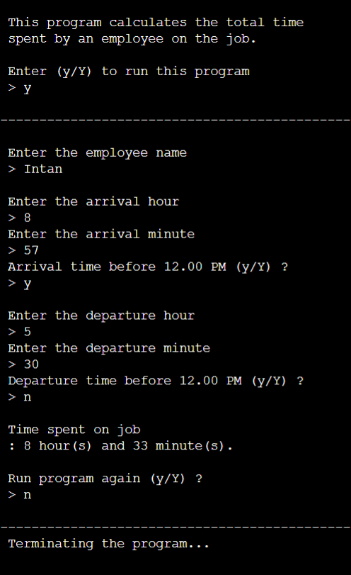

## Project Title
Employee Working Hours Calculator

## Description
This C++ program reads employee's name, arrival and departure
times as inputs from the standard input device ( keyboard ), and 
computes the total working hours spent on his / her job on a 
particular day.

 In the first part of the program, user will be asked to input the 
 following data :
   1. The name of the employee
   2. The employee's arrival hour and minute, in addition whether
      he / she arrived before or after 12.00 PM.
   3. The departure hour and minute of the employee, together with
      whether he / she departed from work before or after 12.00 PM.

 After receiving the required inputs, the program then will calculate
 the total times spent on the job if the employee arrival and departure
 time was before and after noon, respectively. The following steps 
 describes the calculation process :
    1. Convert the arrival time from hour and minute, into minute.
    2. Step 1 is repeated for the departure time.
    3. The formula to find the working duration is shown on the 
       line 182 and line 183.
    4. The total times then will be displayed on the output screen.

After the total time was displayed, the user will be asked if he / she
wished to run the program again or not. The program will run again
if the input entered by the user is either a 'y' or 'Y'. Otherwise, a 
message " Terminating the program..." will be displayed on the screen.

## Sample Output

## Try it Online
[Click here to run Employee Working Hours Calculator]](https://onlinegdb.com/j2Qh-0C1B)

## Reference
Problem adapted from :
DS Malik — *C++ Programming - From Problem Analysis to Program Design*, Chapter 7, Programming
Exercise, Question No.3.

## Author
This program was implemented by [Intan](https://github.com/intanlogiclab).

